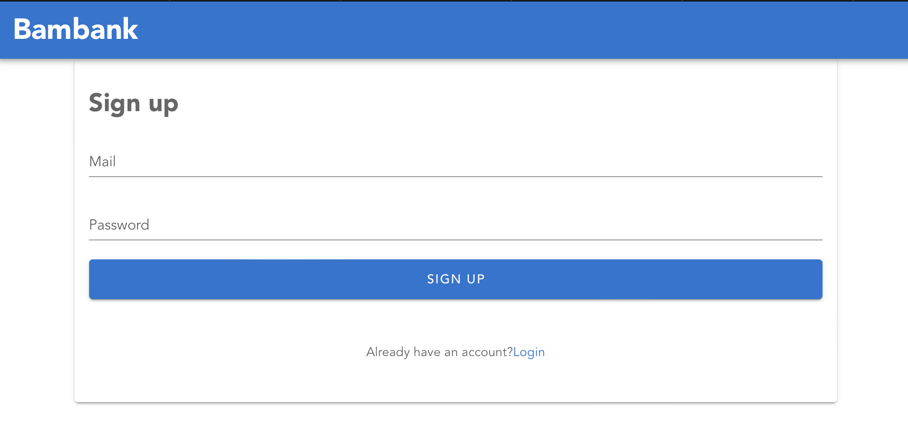
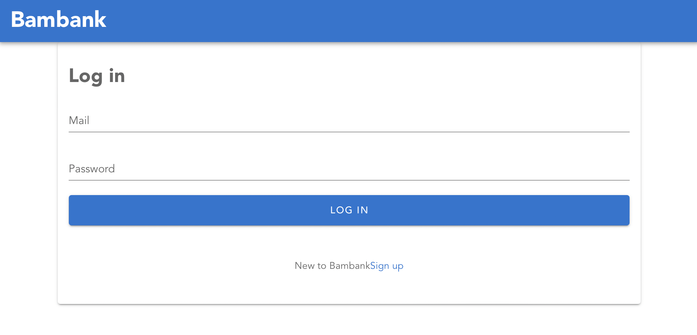
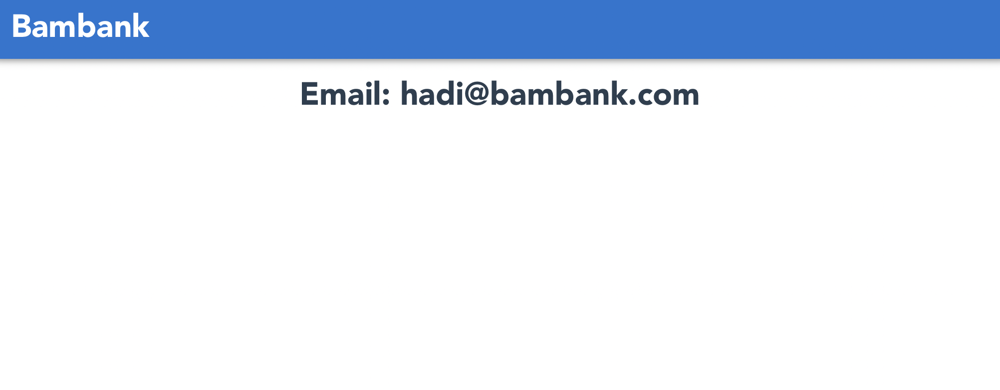

# BamBank

## Code Excercise

### Background

Bamboo have decided to open an online bank, Bambank, with its own currency, Bambeuros.
The new bank will run a promotion giving all new customers 100 free Bambeuros when they
sign up.

#### Requirements

We would like you to build a prototype web application that allows users to:

* Create an account / log in
* ~~View their current balance and transactions~~
* ~~Send Bambeuros to other users~~

#### The Solution

You may use any languages, frameworks and technologies you like. Please provide:

- A link to the Git repo containing your solution

  - Ideally GitHub, but any Git hosting service is fine (eg BitBucket, GitLab, etc.)
- A separate, initial commit of any automatically-generated code

  - For example, from rails new, so we can easily see your changes
- A README:

  * Instructions on how to run/deploy your solution
  * A list of any assumptions you make
  * Any other relevant information you want to provide

#### Expectations

* We don't want you to spend more than two hours on this test!
* Don't worry if you don't end up with a full working solution

## Demo

For live demo go to this link https://bambank-68e88.web.app/auth

## Screenshots

Below are some screenshots of signup, login and home page.

### SignUp



### Login



### Home



## Project setup

In order to run this project locally the following libraries/frameworks must be installed :

```
vue-cli 5
node 18
npm 8
```

### Setup Firebase

Setup a firebase project by following [this](https://firebase.google.com/docs/web/setup) link

Update below enviroment variables according to your firebase project settings

```
VUE_APP_API_KEY=''
VUE_APP_AUTH_DOMAIN=''
VUE_APP_PROJECT_ID=''
VUE_APP_STORAGE_BUCKET=''
VUE_APP_MESSAGE_SENDER_ID=''
VUE_APP_APP_ID=''
VUE_APP_MESUREMENT_ID=''
VUE_APP_GIPHY_API_KEY=''
```

### Install

```
npm install
```

### Compiles and hot-reloads for development

```
npm run serve
```

### Compiles and minifies for production

```
npm run build
```

### Run unit tests

```
npm tun test:unit
```

### Run end to end tests

```
npm tun test:e2e
```

## Deploy

A PR can be open against `main` branch which will automatically deploy the branch using GitHub Actions into Google Cloud Platform providing a preview link
